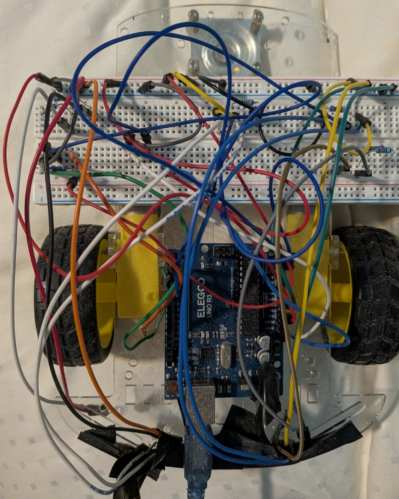
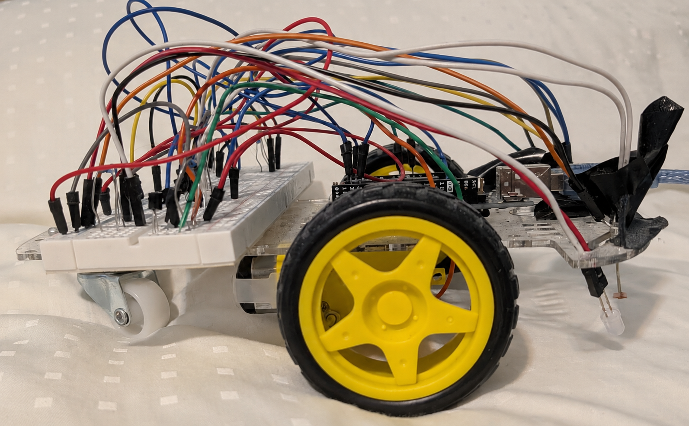
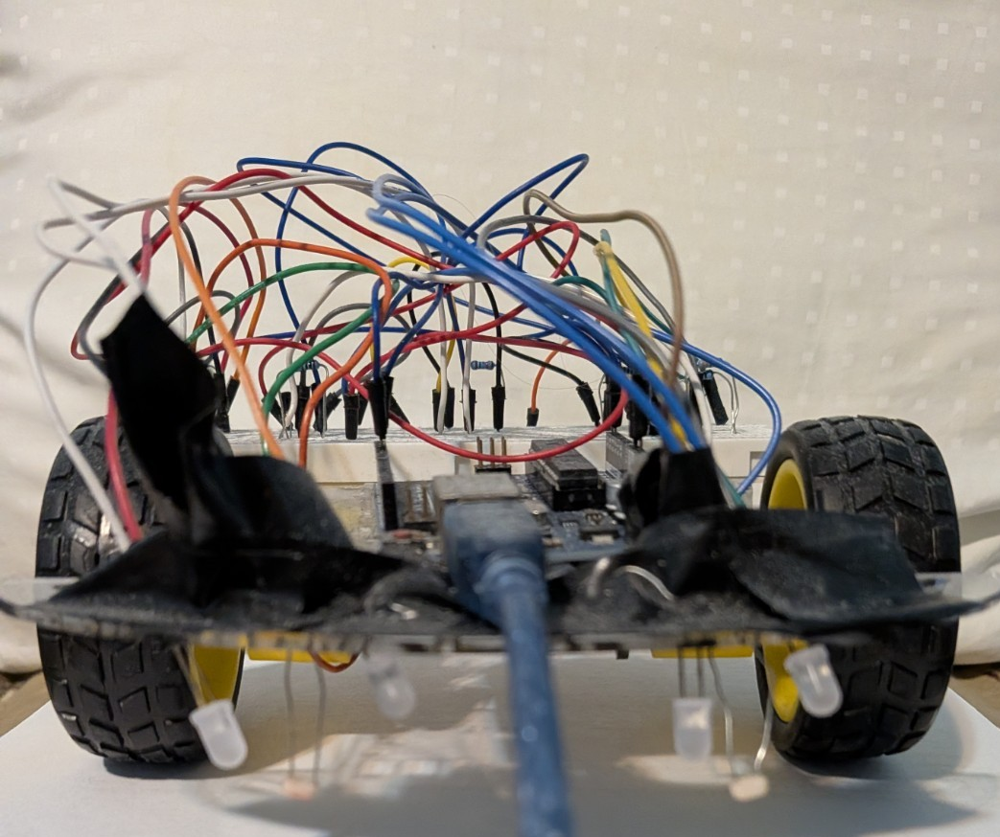

# Arduino Line-Following Robot

This project was completed as part of an Electrical and Computer Engineering laboratory course at the University at Albany.

The goal was to design and build an autonomous robot capable of following a track using an Arduino, optical sensors, and independently controlled DC motors. The project involved circuit design and prototyping, embedded programming, sensor calibration, hardware/software integration, and troubleshooting.

## Finished Robot

The completed robot was built around an Arduino Uno with the supporting circuitry assembled on a solderless breadboard. Sensors mounted near the front of the chassis were used to detect the track, while two independently controlled motors allowed the robot to make steering corrections.

### Top View

### Side View

### Front View

## Project Overview

The project was completed in several stages. I first worked on the sensing and motor-control portions of the design individually before combining them with the Arduino software into the finished robot.

Once the individual parts were working, most of the remaining work involved testing and troubleshooting the complete system. The robot was tested on several track layouts with different combinations of straight sections and curves.

One of the more useful parts of the project was seeing how much harder troubleshooting becomes once several systems are interacting. Problems with the robot's behavior could come from the circuit, sensor readings, software, mechanical setup, or connections between components.

For example, sensor behavior that appeared consistent while testing the circuit by itself was not always as consistent once the motors and the rest of the robot were operating. The breadboard construction also meant that vibration and movement could occasionally affect connections. Working through these problems required testing parts of the system independently before testing the complete robot again.

## Project Takeaways

This was one of my first projects that required combining several parts of an electrical/computer engineering system into one working device.

The project gave me practical experience with:

- Arduino and embedded programming
- Analog sensors
- DC motor control
- Transistor circuits
- Breadboard prototyping
- Hardware/software integration
- Sensor calibration
- Circuit testing
- Systematic troubleshooting

One of the biggest takeaways was that getting each part working individually was only part of the project. Once everything was connected together, interactions between the electrical, software, and mechanical parts introduced problems that were not always present during individual testing.

## What I Would Change

If I built another version, I would focus mostly on improving the reliability and construction of the robot.

The prototype used a solderless breadboard and a large number of jumper wires, which worked well for development but was not ideal for something that moves and vibrates. A soldered board or PCB with better cable management would make the finished system much more reliable.

I would also look at improving the sensor and motor-control hardware and using a more refined control method to make steering smoother.

## Technologies & Skills

`Arduino` `Embedded C/C++` `Analog Electronics` `Sensors` `DC Motors` `Transistors` `Breadboarding` `Hardware Debugging` `Hardware/Software Integration`

---

## Source Code & Design Files

This project was completed as university coursework. Source code, schematics, component values, and other implementation details are kept private to preserve academic integrity and are available upon request for professional review.
